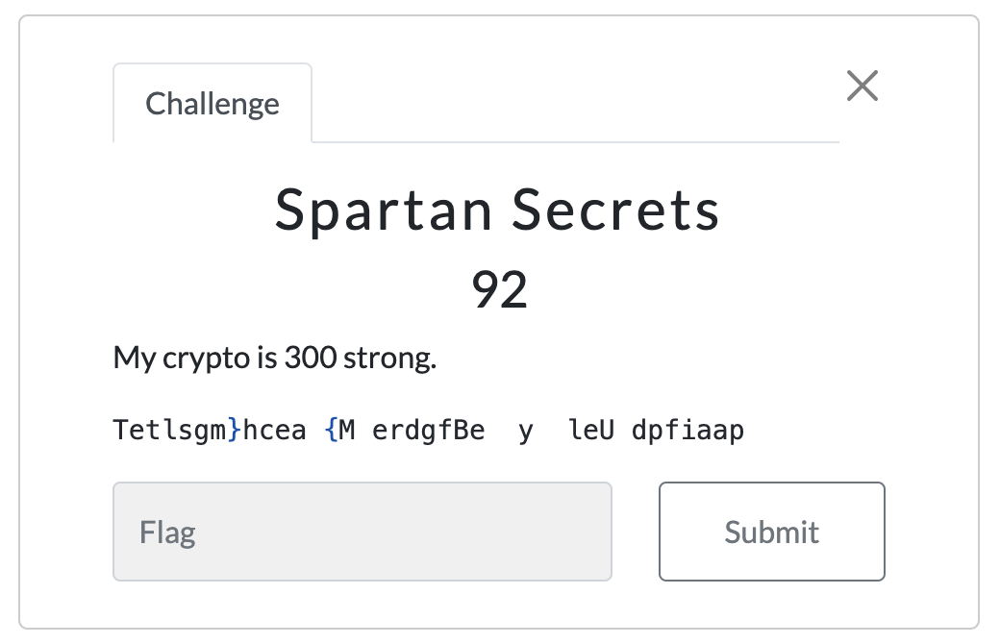
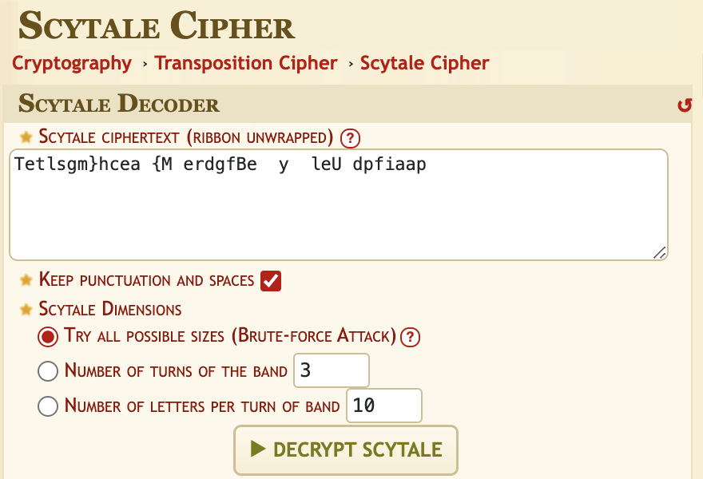
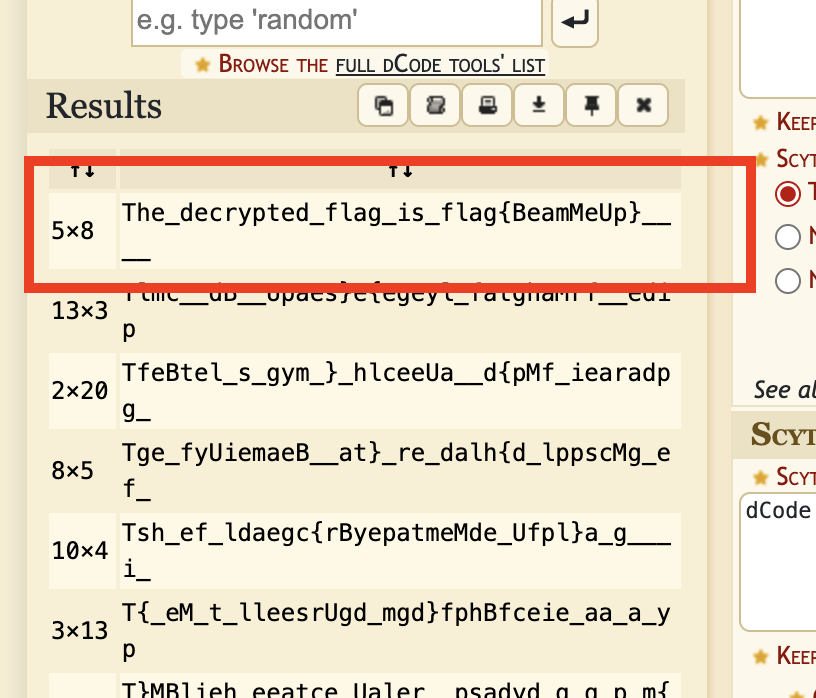

# Spartan Secrets

Writeup by 0xfeeb

## Description

The challenge was as follows:

## Solution

After doing some Googling, I discovered the Greeks (and particularly Spartans) used something called a [Scytale](https://en.wikipedia.org/wiki/Scytale) for sending encrypted messages!

I found a Scytale solver [here](https://www.dcode.fr/scytale-cipher), and plugged in the encrypted text from the challenge. Be sure to check the "Keep punctuation and spaces" box:

Then, with "Try all possible sizes" selected, click "DECRYPT SCYTALE", and the top hit is the answer!

