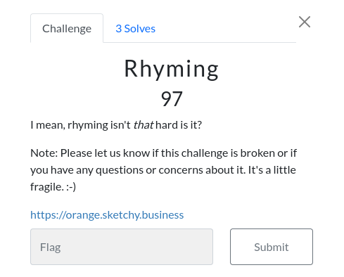
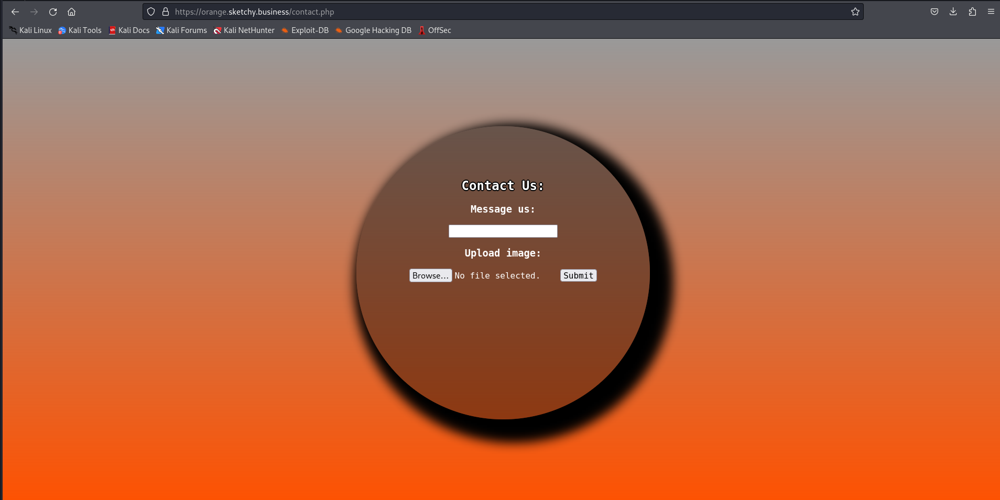
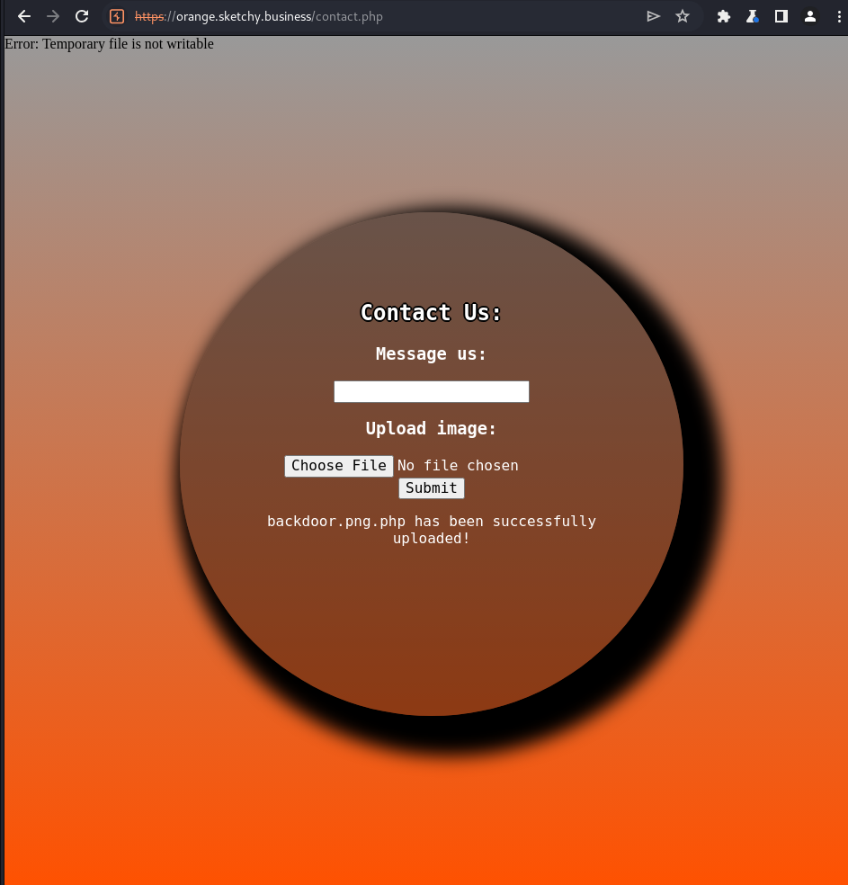
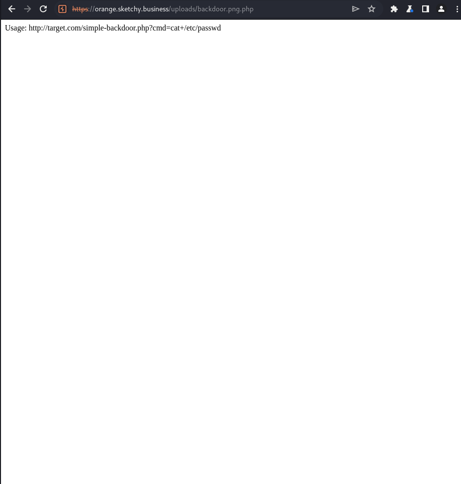
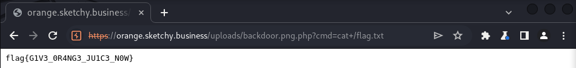

# Rhyming

Writeup by Landon Rice @landxnsec

This challenge, we are met with a basic file upload vulnerability along with a filter bypass, leading to RCE. Let's explore it!

## Description

Our challenge is as follows:

## Solution

Upon visiting, we are met with a nice looking homepage for a technology company. Our only lead we can grab from here is the `Contact Us` form. Let's investigate!

Here we see a contact page with two forms of input. A "message us" functionality, and an image upload. Looking at the .php extension on the top, we can start guessing how this vulnerability might play out. Just by a gut feeling, I decided to start testing the "Upload Image" functionality to see if we can gain remote code execution.

Easy enough! Since we know this server is running php, we can simply upload a php webshell and ez pwn, right? Well, that's unfortunately not the case. Attempting to upload our basic webshell (found in kali @ `/usr/share/webshells/php/simple_backdoor.php`) gives us an error message, reading "Please only uplaod images." This is where you have to do a bit of guess and check, referring to this [HackTricks page](https://book.hacktricks.xyz/pentesting-web/file-upload) about file upload vulnerabilities and potential bypasses. I did a good bit of messing around before I was finally able to get my payload bypassing the upload restrictions with the good old double-extension trick.

Another gut guess here, I decided to check for my file in the /uploads/ folder on the website. Generally if this doesn't work, I end up going through dirb/gobuster to attempt to enumerate the exposed filesystem. In a stroke of luck, the generic /uploads/ folder works, and we are able to visit our backdoor! 

Great! Our backdoor gives us a tutorial on how to use it as soon as we visit it. Let's hit this with our final exploit, running `cat+/flag.txt` against the webshell. And with that, we finally get our flag!

## OPSEC Note

The way I exploited this is bad practice in a real-world scenario. This is an isolated CTF environment, so I did not take the necessary steps to ensure I was not opening up a real client to a potential security incident. In a realistic environment, ensure your webshell has methods so that you don't give everyone and their mothers access to your backdoor.